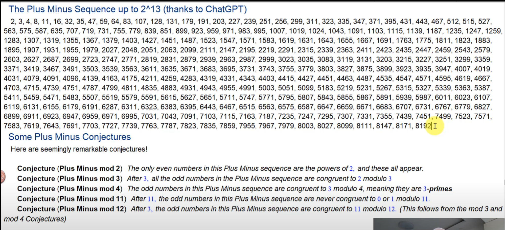

# Plus Minus Sequence

The Plus Minus Sequence is a number sieve described in the video [Extraordinary new sieve variants (Plus Minus) | Number theory and Sieve Magic | Wild Egg Maths](https://youtu.be/ILmPuDn3ZZw?si=TB4fqVwi1EmBvFVT).

## Output Sequence up to 10,000,000

You can find the output sequence up to 10,000,000 in the file [`plus_minus_sequence_results.txt`](plus_minus_sequence_results.txt).

## Conjectures

Conjecture 1: All even numbers are powers of two and these all appear  
Conjecture 2: All odd numbers after three are congruent to 2 mod 3  
Conjecture 3: All odd numbers are congruent to 3 mod 4  
Conjecture 4: All odd numbers after eleven are not congruent to 0 or 1 mod 11  
Conjecture 5: All odd numbers after three are congruent to 11 mod 12  
Conjecture 6: All odd numbers after three are congruent to 5 mod 6  
Conjecture 7: All odd numbers are congruent to 3 or 7 mod 8  
Conjecture 8: All odd numbers after three are congruent to 11 or 23 mod 24  
Conjecture 9: The difference between all consecutive odd numbers is congruent to 0 mod 12

## Requirements to run the program

You need to have Rust installed to run the program. You can download Rust at [rust-lang.org](https://www.rust-lang.org/).

## Run the program

```
cargo run --release
```

This will run the program with the default upper limit of 1,000,000, check the conjectures, save the output sequence to a file, and print main results to the terminal.

```
cargo run --release 1000
```

This will run the program with the upper limit of 1,000.

## Sieve algorithm



